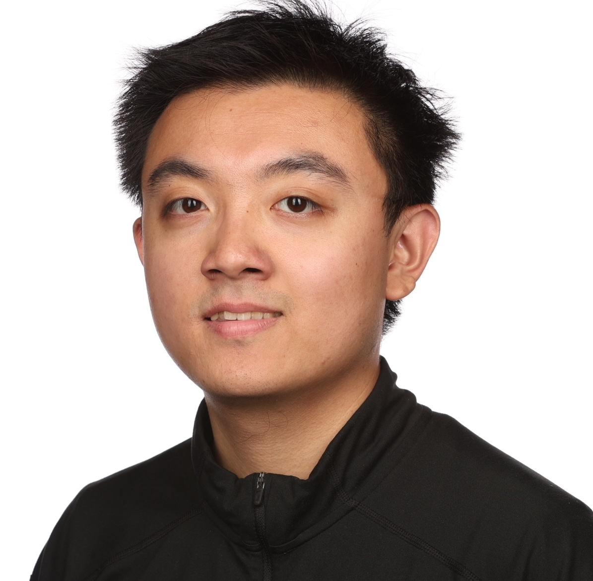

I am an second-year Ph.D. student at UChicago [Data Science Institute](https://datascience.uchicago.edu/) (DSI). At DSI, I have the pleasure of working with [Prof. Nikolaos Ignatiadis](https://nignatiadis.github.io/) and [Prof. Haifeng Xu](https://www.haifeng-xu.com/). Previously, I finished my M.S. in Statistics under the supervision of [Prof. Daniel Sanz-Alonso](https://sites.google.com/a/uchicago.edu/sanz-alonso/). I am also a part of the [AER Lab](https://musslick.github.io/AER_website/About.html) under the mentorship of [Prof. Sebastian Musslick](https://smusslick.com/). Here is my [Google Scholar](https://scholar.google.com/citations?user=XBTlUzUAAAAJ&hl=en&oi=sra).

My research focuses on developing and validating **principled frameworks** that leverage abundant, noisy signals from **large models** to improve the **statistical efficiency, interpretability, and real-world performance** of decision-making systems. I work on problems that can be viewed from dual perspectives: 

1. From a _**theorist**_ perspective, I design systems that retain **statistical rigor and formal guarantees**. This involves adapting principles from Empirical Bayes and high-dimensional statistics to create methods that are provably sound.

2. From a _**practitioner**_ perspective, I build systems that provide **actionable insights and lower noise-levels**. My work aims to move beyond abstract metrics to create methods that integrate with black-box models, identify reliable signals from noise, and enable real-world impact.

_More about me_: even earlier, I graduated from UC Berkeley [EECS](https://eecs.berkeley.edu/) & [Statistics](https://statistics.berkeley.edu/). I enjoyed working as a software engineer in an "earlier life".

<!-- For **current/prospective students** having questions about M.S./Ph.D. applications in Statistics/DS, I plan to spend an hour every week doing online Q&A. Feel free to book my time [here](projects/external_opportunities); for current <u>UChicago undergrad/master</u> interested in my variational inference reading list, you can contact me for potential [reading program](projects/external_opportunities#reading). -->
